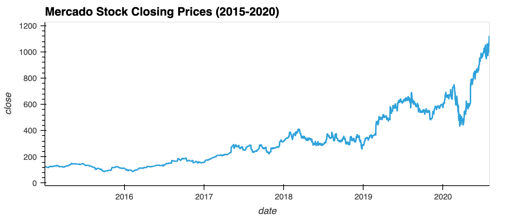

# Time Series Analysis Challenge: Forecasting Net Prophet

## Background

In this scenario, I am a growth analyst at [Mercado Libre](http://investor.mercadolibre.com/investor-relations). With over 200 million users, Mercado Libre is the most popular e-commerce site in Latin America. I've been tasked with analyzing the company's financial and user data in clever ways to help the company grow. 

In a bid to drive revenue, I’ll produce a Jupyter notebook that contains my data preparation, analysis, and visualizations for all the time series data that the company needs to understand. I’ll use text and comments to document my findings. And, I’ll answer the question prompts in the instructions. Specifically, this notebook will contain the following:

- Visual depictions of seasonality (as measured by Google Search traffic) that are of interest to the company.

- An evaluation of how the company stock price correlates to its Google Search traffic.

- A Prophet forecast model that can predict hourly user search traffic.

- Answers to the questions in my Jupyter notebook.

- (Optional) A plot of a forecast for the company’s future revenue.

### Table of Contents

1. [Step 1: Find unusual patterns in hourly Google search traffic](#Step-1)

2. [Step 2: Mine the search traffic data for seasonality](#Step-2)

3. [Step 3: Relate the search traffic to stock price patterns](#Step-3)

4. [Step 4: Create a time series model by using Prophet](#Step-4)

5. [Step 5 (optional): Forecast the revenue by using time series models](#Step-5)

---

## Files

The 'forecasting_net_prophet_Colab.ipynb' file contains my analysis of Mercado Libre search traffic trends, closing prices, and Prophet forecasts across a series of time periods.
* [Forecasting Net Prophet notebook](Code/forecasting_net_prophet_Colab.ipynb)

The 'Data' directory contains different periods.
* [Data files](Data/)

---

### Step 1: Find Unusual Patterns in Hourly Google Search Traffic

The data science manager at Mercado Libre asks if the Google search traffic for the company links to any financial events at the company. Or, does the search traffic data just present random noise? To answer this question, I’ll pick out any unusual patterns in the Google search data for the company, and connect them to the corporate financial events.

1. Read the search data into a DataFrame, and then slice the data to just the month of May 2020. (During this month, Mercado Libre released its quarterly financial results.) Use hvPlot to visualize the results. Do any unusual patterns exist?

*While it is really nothing unusual, search traffic tends to vary drastically throughout each day in an oscillating pattern.*

2. Calculate the total search traffic for the month, and then compare the value to the monthly median across all months. Did the Google search traffic increase during the month that Mercado Libre released its financial results?

*Yes. The median value of Google search traffic is 35172.5 compared to a total of 38181 searches in May alone. There was a spike in search traffic in early May.*

### Step 2: Mine the Search Traffic Data for Seasonality

The Marketing department realizes that they can use the hourly search data, too. If they can track and predict interest in the company and its platform for any time of day, they can focus their marketing efforts around the times that have the most traffic. This will get a greater return on investment (ROI) from their marketing budget.

To help Marketing, I'll want to mine the search traffic data for predictable seasonal patterns of interest in the company.

1. Group the hourly search data to plot the average traffic by the day of the week (for example, Monday vs. Friday).

2. Using hvPlot, visualize this traffic as a heatmap, referencing `index.hour` for the x-axis and `index.dayofweek` for the y-axis. Does any day-of-week effect that you observe concentrate in just a few hours of that day?

*Observation of the generated heatmap shows a high concentration of late-night searches early in the week, a very low concentration of searches between 5am and 10am everyday, and Saturday experiencing the least number of searches overall.*

3. Group the search data by the week of the year. Does the search traffic tend to increase during the winter holiday period (weeks 40 through 52)?

*While search traffic varied throughout the year, we can observe a sharp dip in traffic between weeks 40 and 42 followed by a sharp and near-continuous spike in search traffic to the end of the winter holiday period.*

### Step 3: Relate the Search Traffic to Stock Price Patterns

During a meeting with people in the Finance group, I mention my work on the search traffic data. They want to know if any relationship between the search data and the company stock price exists, and they ask if I can investigate.

1. Read in and plot the stock price data. Concatenate the stock price data to the search data in a single DataFrame.

2. Note that market events emerged during 2020 that many companies found difficult. But after the initial shock to global financial markets, new customers and revenue increased for e-commerce platforms. So, slice the data to just the first half of 2020 (`2020-01` to `2020-06` in the DataFrame), and then use hvPlot to plot the data. Do both time series indicate a common trend that’s consistent with this narrative?

*Yes, both time series share a common trend consistent with this narrative, especially during the month of March 2020, exhibiting a dramatic decrease in closing price and search traffic.*

3. Create a new column in the DataFrame named “Lagged Search Trends” that offsets, or shifts, the search traffic by one hour. Create two additional columns:

   - “Stock Volatility”, which holds an exponentially weighted four-hour rolling average of the company’s stock volatility

   - “Hourly Stock Return”, which holds the percentage of change in the company stock price on an hourly basis
   

4. Review the time series correlation, and then answer the following question: Does a predictable relationship exist between the lagged search traffic and the stock volatility or between the lagged search traffic and the stock price returns?

*No, a predictable relationship does not exist between either pair of metrics*

### Step 4: Create a Time Series Model by Using Prophet

Now, I need to produce a time series model that analyzes and forecasts patterns in the hourly search data.

1. Set up the Google search data for a Prophet forecasting model.

2. After estimating the model, plot the forecast. What is the near-term forecast for the popularity of Mercado Libre?

*The near-term forecast shows a decrease for the first half of 2020 following by what appears to be a sharp and consistent increase for the last three months of the year.*

3. Plot the individual time series components of the model to answer the following questions:

   - What time of day exhibits the greatest popularity?
    *Late-nights before and after midnight exhibit the greatest popularity.*
   - Which day of the week gets the most search traffic?
    *Tuesdays get the most search traffic each week, on average.*
   - What's the lowest point for search traffic in the calendar year?
    *The lowest point for search traffic in the year occurs in the second half of October.*

   
   

### Step 5 (Optional): Forecast the Revenue by Using Time Series Models

A few weeks after my initial analysis, the finance group follows up to find out if I can help them solve a different problem. My fame as a growth analyst in the company continues to grow!

Specifically, the finance group wants a forecast of the total sales for the next quarter. This will dramatically increase their ability to both plan budgets and help guide expectations for the company investors.

1. Read in the daily historical sales (that is, revenue) figures, and then apply a Prophet model to the data.

2. Interpret the model output to identify any seasonal patterns in the company revenue. For example, what are the peak revenue days? (Mondays? Fridays? Something else?)

*Peak revenue days are Tuesdays and Wednesdays.*

3. Produce a sales forecast for the finance group. Give them a number for the expected total sales in the next quarter. Include the best- and worst-case scenarios to help them make better plans.

*Based on the generated forecast informaton, we can be expecting, in the best case scenario, 24,672.65 total sales, contrary to a worse case scenario with 20,827.49 sales. However, we're most likely to see 22,750.09 sales in the next quarter.*

---